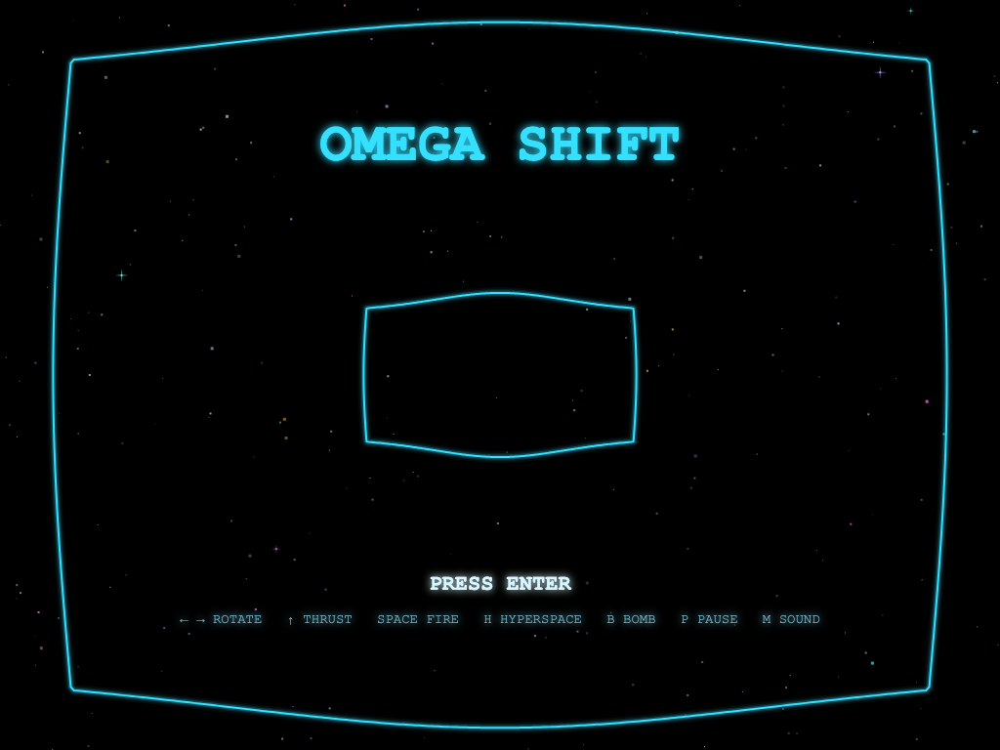
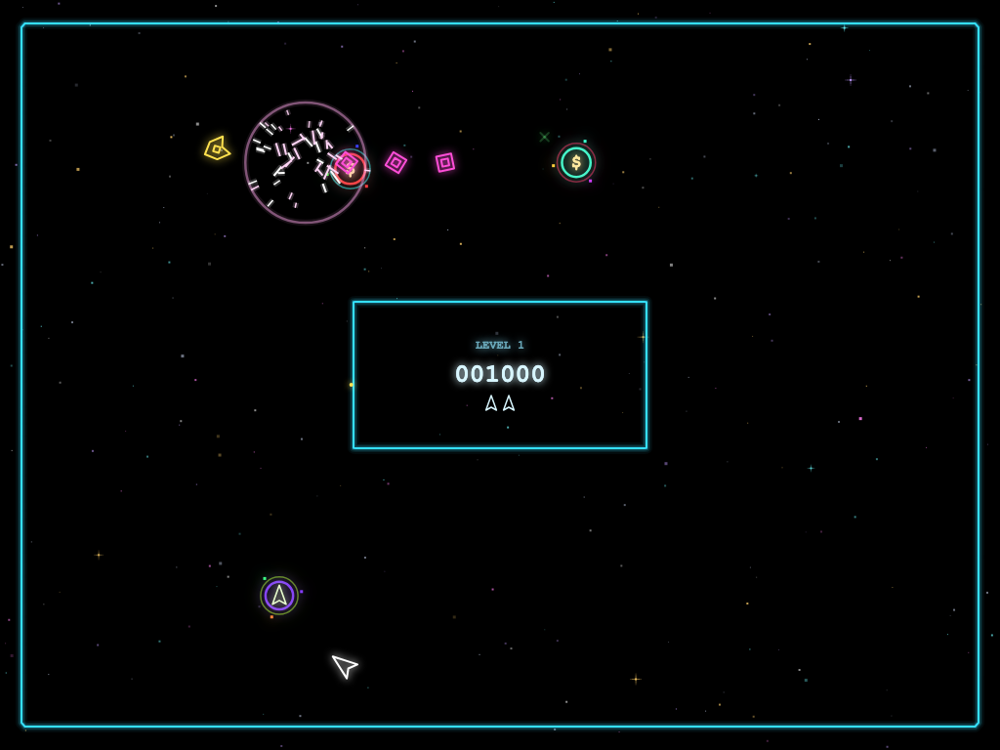
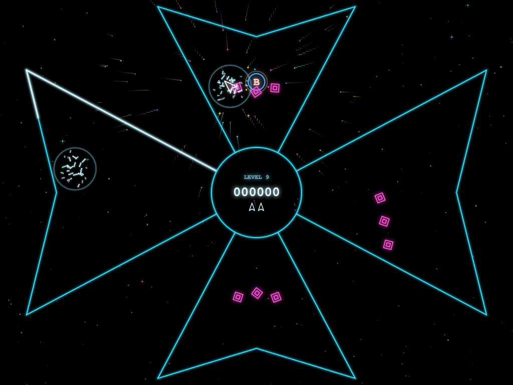
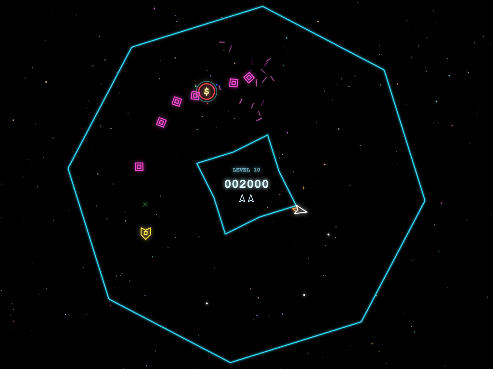
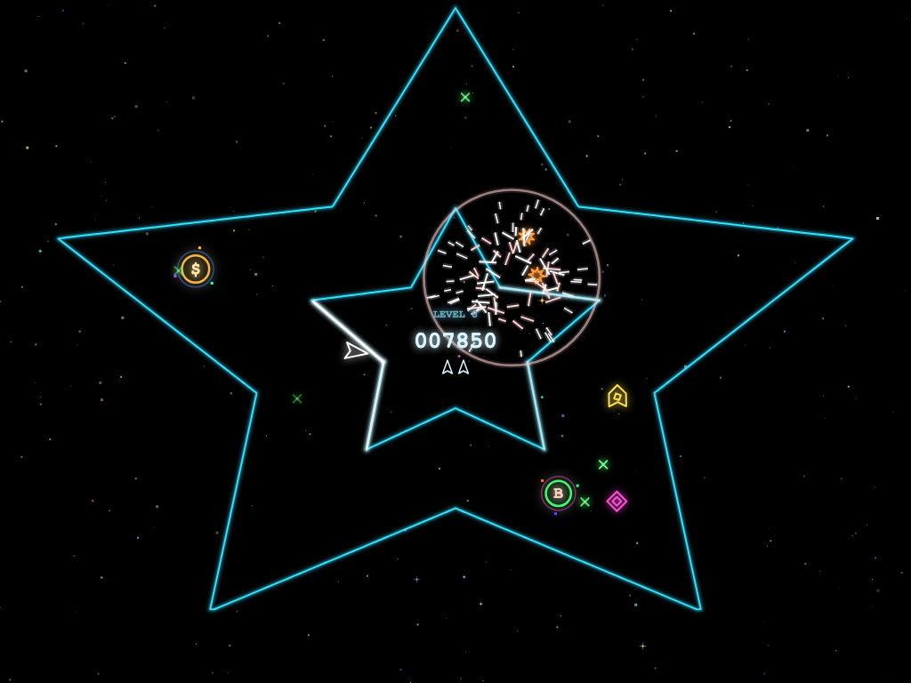
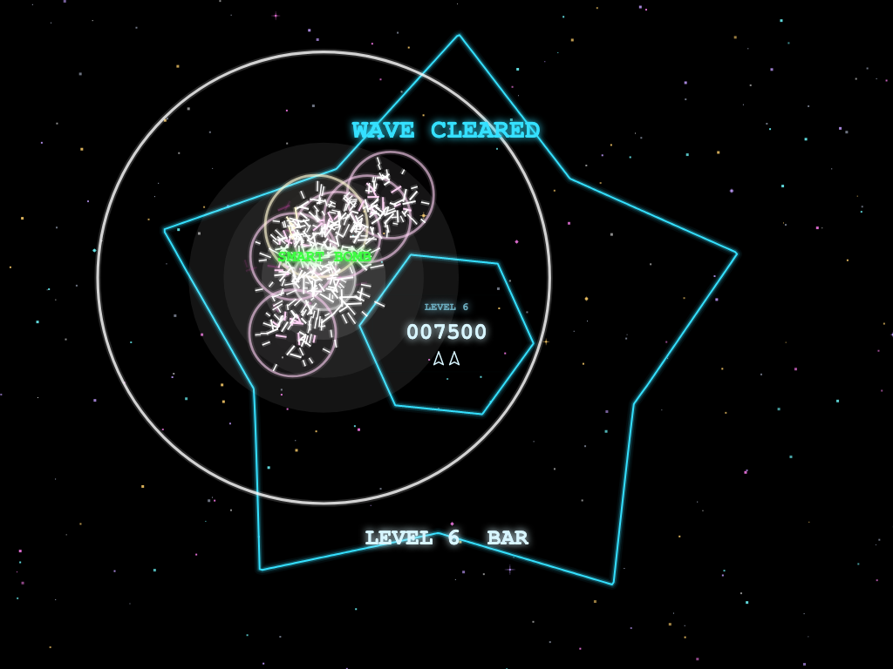

# Omega Shift

**A vector-arcade shooter in the browser, inspired by 1981's *Omega Race*, where the force fields won't keep still.**

▶ **Play it: https://richard-i-anderson.github.io/omega-shift/** (keyboard required)

<table>
  <tr>
    <td></td>
    <td></td>
  </tr>
  <tr>
    <td></td>
    <td></td>
  </tr>
  <tr>
    <td></td>
    <td></td>
  </tr>
</table>

## The inspiration: Omega Race (1981)

[*Omega Race*](https://en.wikipedia.org/wiki/Omega_Race) was released by Midway in August 1981. It was designed by Ron Haliburton, and it is Midway's only arcade game with vector graphics, the glowing lines of light that also drew *Asteroids* and *Tempest*.

You flew a lone fighter around a rectangular track that circled a box in the middle of the screen. The walls of the arena were force fields your ship bounced off. You rotated the ship with a spinner, and had a button to thrust and a button to fire. Enemy droid ships patrolled the track, and they turned into faster and more dangerous ships the longer you left them alive. Home versions followed:
- Commodore 64 and VIC-20 in 1982.
- ColecoVision and Atari 2600 from CBS Electronics in 1983. The 2600 version came with a "Booster Grip" that clipped onto the joystick to add separate thrust and fire buttons.

*Omega Shift* keeps the core of it:
- a momentum-heavy ship that rotates, thrusts and fires.
- bouncy walls whose struck side flashes.
- a score box in the middle.
- droids that are promoted to command ships (which shoot and lay photon mines) and then to death ships (which hunt you down and lay vapor mines).

The twist is in the name: the force fields change shape.

*Omega Shift* is a fan-made homage. It isn't affiliated with or endorsed by the owners of *Omega Race*, and the name was chosen to stay distinct from it.

## What's new

- **Eleven arenas.** Rectangle, ring, cross, diamond, bar, pillar, star and Maltese cross, plus three levels that move while you fight:
  - **SHIFT** morphs from one shape to the next.
  - **SPIN** turns a star around a counter-rotating hexagon that breathes in and out.
  - **VORTEX** spins a cross that becomes an octagon.

  After level 11 the list repeats, faster.
- **Walls that push.** A moving force field shoves your ship, the enemies and the mines.
- **Score box outside the arena.** On the thin bar and pillar levels there's no room for the score box, so it shrinks away and the score slides off into a panel outside the arena.
- **Isolated chambers and hyperspace.** The Maltese cross seals its four arms off from each other. Press **H** to hyperspace into the next arm (anywhere else, H jumps you to a random spot).
- **Tankers.** From level 5 on (one at a time until level 9, then two), armoured violet tankers crawl the track against the droids. They take a dozen or more hits, and until you destroy one it keeps launching droids, command ships and even death ships. A smart bomb only dents one. Each one you destroy leaves a bonus.
- **Bonuses.** Enemy ships leave rainbow-ringed bonuses behind as they fly: an extra life (up to six), 5,000 points, a **smart bomb** that destroys every enemy in the arena (apart from tankers) when you press **B**, or a **shield** that makes you invincible for 15 seconds, with a bar across the top of the screen counting it down.
- **A welcome briefing.** Leave the title screen alone for a few seconds and the story and a guide to the enemies type themselves out in a vector font.
- **Pizzazz.**
  - Explosions scale with the size of what blew up: tumbling shards, sparks, a shockwave and screen shake.
  - A coloured, drifting starfield that flares around explosions and warps when you hyperspace.
  - Synthesised 80s arcade sound: a droning cabinet hum, a danger pulse that speeds up as the threat rises, and an attract jingle to lure you in from across the pub.

## Controls

| Key | Action |
|---|---|
| ← → (or A D) | Rotate |
| ↑ (or W) | Thrust |
| Space | Fire (Space or Enter starts a game) |
| H | Hyperspace |
| B | Smart bomb |
| P or Esc | Pause |
| M | Sound on/off (remembered) |

Add `?debug` to the URL for developer keys: `1`–`9`, `0` and `-` jump to levels 1–11, `` ` `` shows the enemy track and wall normals, and `F` shows frame timing.

## Running it locally

```sh
npm install
npm run dev          # http://localhost:5173
npm test             # the full test suite, including a physics stress test on every level
npm run build        # static bundle in dist/
```

It's TypeScript and HTML canvas, bundled with Vite, with no game engine and no runtime dependencies. Every push to `main` runs the tests and deploys to GitHub Pages.

## How it works

Every force field is a star-shaped curve stored as 720 distances from the arena centre. That one choice makes morphing between any two shapes a simple blend, gives the enemies an orbit track on every level (halfway between the two fields), and lets validation prove that no level ever pinches the corridor too narrow. [`CLAUDE.md`](CLAUDE.md) describes the architecture, and [`docs/DECISIONS.md`](docs/DECISIONS.md) records why things are the way they are, including the bugs and dead ends along the way.
